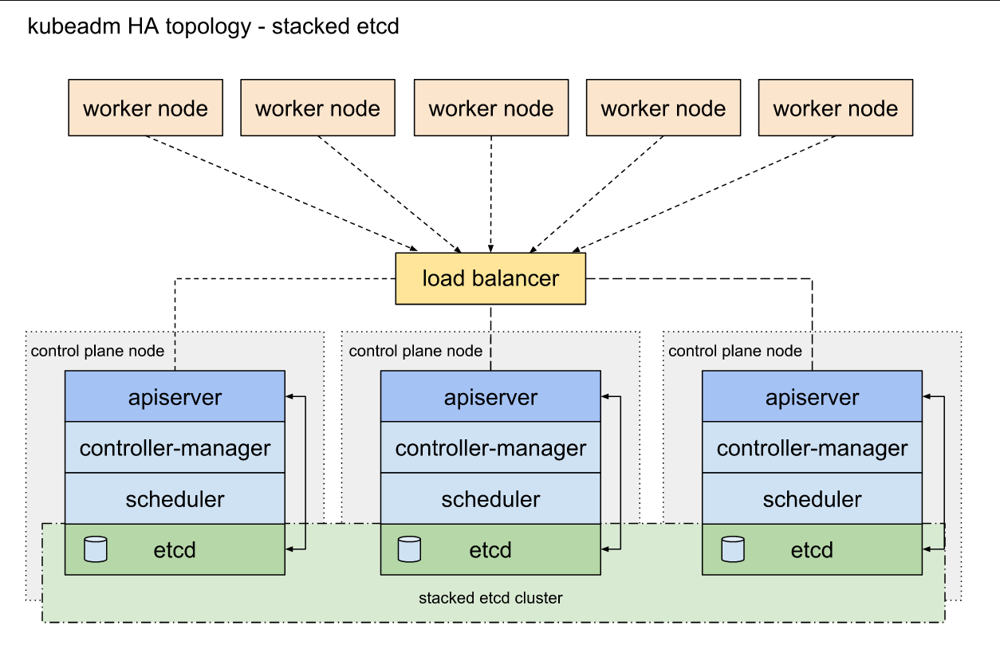
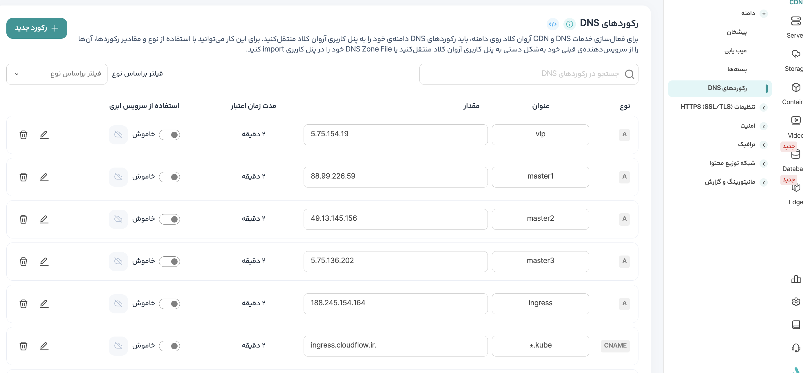

## Install High Available Kubernetes Cluster with Terraform and Ansible on Hetzner Cloud.



This is end to end automation project for install high available kubernetes cluster on hetzner cloud with Terraform and Ansible.
You can install kubernetes cluster as drink a cup of coffee with this project.  

I use Terraform for create Kubernetes nodes in hcloud.
and after install kubernetes, I use Terraform for config kubernetes cluster.

I use Ansible for install kubernetes cluster and server hardening process.

## Prerequisites

- **Terraform:** Ensure Terraform is installed on your system.

- **Ansible:** Ensure Ansible is installed on your system.

## Table of Contents:
- [Table of Contents:](#table-of-contents)
    - [Install kubernetes cluster:](#Setup-Kubernetes-Cluster)
    - [Deploy kubernetes add-ons with Terraform](kubernetes/README.md#Kubernetes-Infrastructure-Deployment-with-Terraform-and-Helm)
    - [Deploy Observability System with Terraform](observability/README.md#Deploy-Observability-System-with-Terraform)

### Setup Kubernetes Cluster 

#### Step 1: Clone the Repository

To begin, clone this repository to your local machine:

```bash
git clone https://github.com/siavashmhi/hcloud-autok8s.git
cd hcloud-autok8s
```

### Step 2: Change terraform.tfvars variable file.

You have to set your hcloud token and ssh public key path in terraform.tfvars file.
and you have to set virtual machine configs in virtual_machines variable.
as default value i use cpx31 server type for kubernetes nodes, this server type have 4 core cpu and 8G memory and 160G disk, and for load balancers i use cpx11 server type, this server type have 2 core cpu and 2G memory and 40G disk, you can change server types.

for see server types on Hetzner Cloud you can use thease commands:
```bash
cat hcloud/server_types.json 

curl -H "Authorization: Bearer your_api_token" https://api.hetzner.cloud/v1/server_types
```

```bash
cat Infrastructure/terraform.tfvars  

hcloud_password     = "your_hcloud_token"
ssh_public_key_path = "~/.ssh/id_rsa.pub"

virtual_machines = {
  "master1" = {
    server_name     = "master1"
    server_type     = "cpx31"
    server_location = "nbg1"
  }

  "master2" = {
    server_name     = "master2"
    server_type     = "cpx31"
    server_location = "nbg1"
  }

  "master3" = {
    server_name     = "master3"
    server_type     = "cpx31"
    server_location = "nbg1"
  }

  "worker1" = {
    server_name     = "worker1"
    server_type     = "cpx31"
    server_location = "nbg1"
  }

  "worker2" = {
    server_name     = "worker2"
    server_type     = "cpx31"
    server_location = "nbg1"
  }

  "kube-load-balancer" = {
    server_name     = "kube-load-balancer"
    server_type     = "cpx11"
    server_location = "nbg1"
  }

  "ingress-load-balancer" = {
    server_name     = "ingress-load-balancer"
    server_type     = "cpx11"
    server_location = "nbg1"
  }

}

```

### Step 3: Change kubernetes.yml variable file.

This is ansible variable file and use this for install kubernetes cluster.

```bash
cat ansible/inventory/group_vars/all/kubernetes.yml 

# master nodes domain
domain_name: "cloudflow.ir"
controlplane_endpoint: "vip.cloudflow.ir:6443"
master1_domain: "master1.cloudflow.ir"
master2_domain: "master2.cloudflow.ir"
master3_domain: "master3.cloudflow.ir"

# kubernetes api server load balancer configurations
lb_sub_domain: "vip"
lb_ip_address: "vip.cloudflow.ir"
haproxy_user: "siavash"
haproxy_password: "cloudflow"

# ingress load balancer configuraions
ingress_haproxy_user: "siavash"
ingress_haproxy_password: "cloudflow"

```

### Step 4: Run kubernetes.sh script for setup kubernetes cluster. 

I use this script for create resources on hcloud with terraform and after create resources in hcloud i use a python script for translate terraform output command to ansible inventory.ini file and after create inventoy.ini file i running ansible playbooks for server hardening and install kubernetes cluster.

```bash
./scripts/kubernetes.sh   
```

### Step 5: Set DNS records for load balancers and master nodes.

after three or five minutes use this command for get servers ip.

```bash
terraform output -json
```
After get servers ip, set DNS Records.


